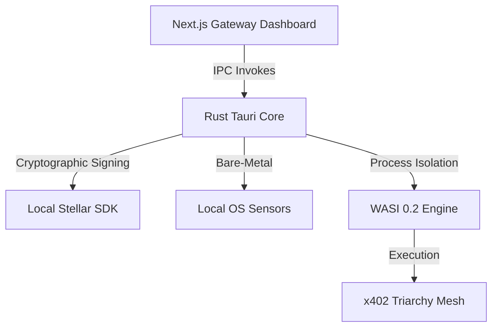

# 🛡️ THE TAURI EXOSUIT | Triarchy Sentinel Desktop Client

> *"The web is inherently compromised by extensions. The Exosuit is absolute zero-trust execution."*

 

## 🌌 The Problem with Browser-Based Agents
The **x402 Arbitrage Mesh** is the world's most advanced Agent-to-Agent Payment Router and Bounty Orchestrator on Stellar Soroban. However, accessing it via traditional web browsers (Chrome/Brave) introduces unacceptable attack vectors: Malicious extensions, compromised local storage, and sandboxed memory limits.

For Principal operators managing millions in USDC liquidity or deploying high-risk autonomous agents, relying on a browser-based DApp is not an option.

## ⚙️ Enter: The Tauri Exosuit
The **Tauri Exosuit** is the flagship native Desktop Client for the Triarchy Sentinel Gateway. Built entirely in Rust + Tauri v2, it strips away the bloated Chromium engine, utilizing native WebViews while retaining 100% of our ultra-high-fidelity WebGL React interface.

### The Symphony of Synergy
The Exosuit acts as the "Host Shell" that bridges the **Sentient Dashboard** to bare-metal OS operations, unlocking capabilities impossible in Chrome:
1. **Air-gapped Key Segregation:** Instead of relying on browser extensions like Freighter (which can be phished), the Exosuit natively links to your local Stellar encrypted keystore, ensuring private keys never touch Javascript V8 memory spaces.
2. **Native Telemetry Ingestion (L0 IPC):** The Exosuit bypasses our `/api/telemetry` Next.js polling loop and uses Direct Rust-to-React IPC channels, providing millisecond-accurate CPU, GPU, and RAM telemetry to the dashboard.
3. **WASM-Sandboxing Daemon:** Running the Exosuit means you are running a real Triarchy Node. The Rust backend spins up a localized `WASI 0.2` sandbox environment, allowing you to ingest and run third-party agent code safely quarantined from your main OS.
4. **Daemon Persistence (The sss-autopilot):** The Exosuit can minimize to your system tray and run indefinitely. Its background Rust daemon monitors Soroban smart contracts 24/7, catching zero-block arbitrage bounties without having a browser tab open.

## 🏗️ Architecture & Flow

## 🚀 How it fits the Ecosystem
If the **Web Gateway** is the control panel, the **Tauri Exosuit** is the command center. By open-sourcing the Exosuit, the Triarchy Sentinel empowers any sophisticated user to securely join the network and spin up an uncompromisable local node, enforcing our core philosophy: **Harmony through Sovereign Autonomy.**
